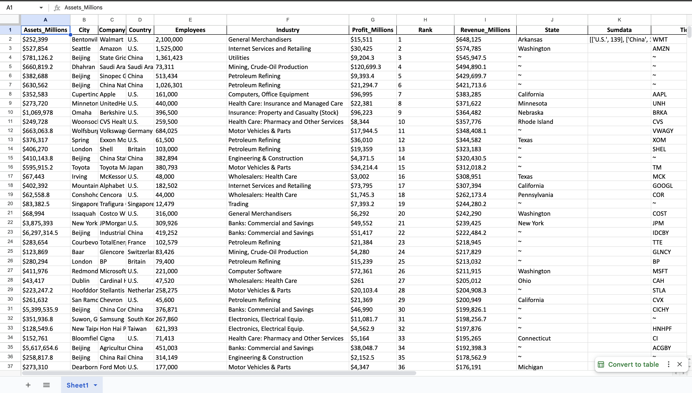

# 🏢 Fortune 500 CLI


A simple Python CLI tool to fetch and export the **latest Fortune 500 company data** from the web. Exported data includes company name, rank, revenue, profits, and more in Excel format.

---

## 🚀 Features

- 📊 Retrieves current Fortune 500 data
- 🧾 Exports to clean Excel file (`.xlsx`)
- 🔍 Fetches all available company columns
- ⚡ Fast and easy to use CLI interface

---
## 📸 Preview




## 📦 Installation

1. **Clone the repo**
```bash
git clone https://github.com/aanchaltripathy/fortune500-cli.git
cd fortune500-cli


